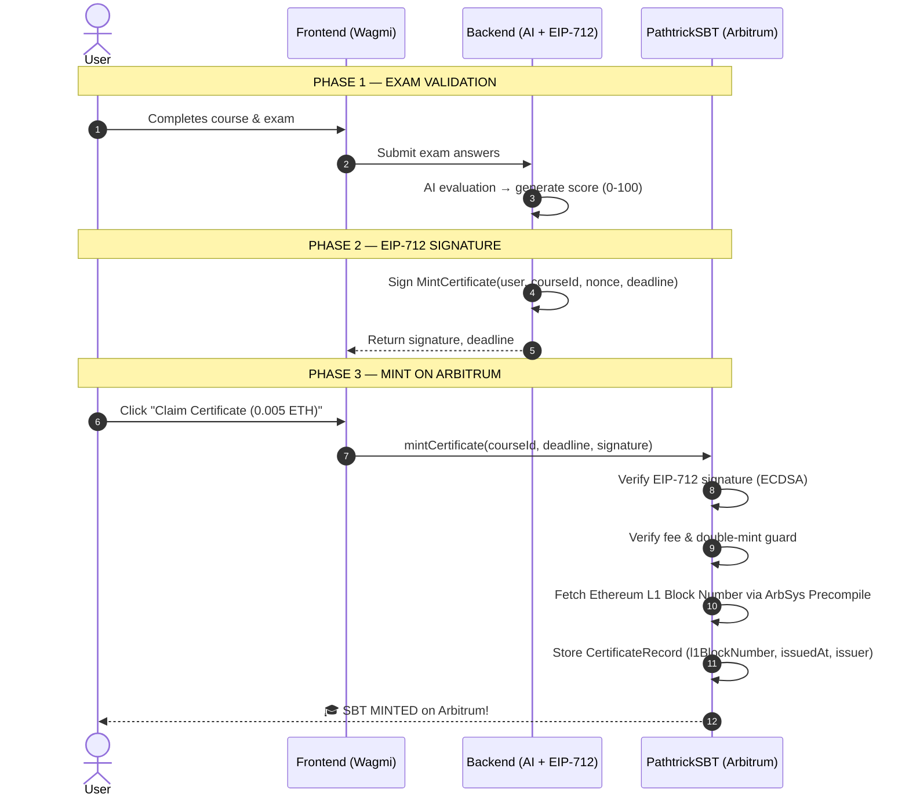

# 📜 PathtrickSBT — On-Chain AI Career Certificate

> **Submitted to: [Arbitrum Open House Singapore — Online Buildathon](https://arbitrum-singapore.hackquest.io/buildathons/Arbitrum-Open-House-Singapore-Online-Buildathon)**

This repository contains the Smart Contract for **PATHTRICK** — an **AI-Native Career Coach** platform that issues verifiable academic credentials on-chain as **Soulbound Tokens (SBT)** deployed on **Arbitrum One**.

Arbitrum was chosen because its ultra-low gas fees make on-chain certificate issuance **accessible to every learner globally** — not just those with deep crypto pockets.

---

## 🌟 The Vision: AI-Native, Closed-Loop Certification
Most Web3 credential platforms today act merely as "digital stampers" for traditional human institutions—leaving the actual learning and grading vulnerable to human bias, low-quality curriculum, and off-chain manipulation. 

**Pathtrick solves this by acting as the AI-Native Institution itself.** 
1. **AI as the Tutor & Examiner:** Users learn from and are objectively evaluated by our AI engine.
2. **AI as the Oracle Signer:** Instead of a human admin, our Backend AI acts as the authoritative judge, mathematically signing (`EIP-712 ECDSA`) the user's graduation proof.
3. **Immutable Proof:** The Smart Contract verifies the AI's signature and mints an untransferable Soulbound Token (SBT). 

We don't just put certificates on the blockchain; **we guarantee the skill behind it.**

---

## 🏗️ Smart Contract Architecture

PathtrickSBT is not just another NFT — it is a full on-chain academic credential system built on 7 pillars:

### 1. 🔷 ERC-1155 on Arbitrum (Gas-Efficient)
Using the **ERC-1155** multi-token standard instead of ERC-721. On Arbitrum, each `mintCertificate` transaction costs approximately **$0.001–$0.01**, making verified on-chain credentials truly affordable at scale.

### 2. 🔒 Soulbound Token (Anti-Fraud)
Educational certificates must not be sold or transferred. The `_update()` hook is overridden to permanently block all transfers. Every SBT holder is **guaranteed to be the person who actually passed the AI exam**.

### 3. 🤖 AI Validation via EIP-712 Signature
Every certificate can only be minted with a valid digital signature from the AI Backend:
- The Backend signs `MintCertificate(user, courseId, nonce, deadline)` using EIP-712 typed data
- The Smart Contract verifies the signature via `ECDSA.recover` — no one can forge a certificate

### 4. 📊 On-Chain Certificate Record & L1 Block Anchoring
Each minted certificate permanently stores:
```solidity
struct CertificateRecord {
    uint128 issuedAt;       // Block timestamp of issuance
    uint64  l1BlockNumber;  // Ethereum L1 block number via ArbSys
    address issuer;         // adminSigner address at time of mint
}
```

**Arbitrum Hackathon Highlight:** We actively utilize Arbitrum's `ArbSys` Precompiled Contract (`0x00...64`). Even though the SBT is minted on the fast, low-cost L2, we anchor the credential's timestamp to the **Ethereum Mainnet L1 Block Number** (`IArbSys(100).arbBlockNumber()`). This provides the absolute cryptographic time guarantee of Ethereum L1 with the scaling benefits of Arbitrum L2.

### 5. 💵 Dual Payment: ETH & Paxos USDG
Users can pay the mint fee using:
- **ETH** (default, 0.005 ETH) via `mintCertificate()`
- **Paxos USDG Stablecoin** via `mintCertificateWithUSDG()` — stable, no price volatility concern

### 6. 🛡️ Course Registry & Revocation
- Only owner-registered `courseId`s can be minted — prevents unauthorized token creation
- Owner can revoke (burn) a certificate in case of misconduct or error

### 7. ⏸️ Pausable Emergency Stop
Owner can instantly halt all minting activity if a vulnerability is discovered.

---

## 🔄 Integration Flow (End-to-End)



---

## 📦 Contract Overview

| Property | Value |
|---|---|
| **Network** | Arbitrum One (chain 42161) / Arbitrum Sepolia (chain 421614) |
| **Token Standard** | ERC-1155 Soulbound Token |
| **Solidity Version** | 0.8.28 |
| **Framework** | Foundry |
| **EIP-712 Domain** | `"PathtrickSBT"` version `"1"` |
| **Test Suite** | 47 tests, 100% passing |

---

## 🛠️ Deployment Guide (Foundry)

### Prerequisites
- [Foundry](https://getfoundry.sh/) installed
- Wallet funded with ETH on Arbitrum Sepolia (get from [faucet](https://www.alchemy.com/faucets/arbitrum-sepolia))
- API key from [Arbiscan](https://arbiscan.io/register)

### 1. Setup Environment
```bash
cp .env.example .env
```

Fill in `.env`:
| Variable | Description |
|---|---|
| `PRIVATE_KEY` | Deployer wallet private key |
| `OWNER_ADDRESS` | Contract admin address (multisig recommended for production) |
| `ADMIN_SIGNER` | Backend AI hot wallet address |
| `ARBISCAN_API_KEY` | Arbiscan API key for contract verification |
| `ARBITRUM_SEPOLIA_RPC_URL` | Arbitrum Sepolia RPC endpoint |
| `USDG_TOKEN` | Paxos USDG token address (`address(0)` on testnet) |
| `TOKEN_URI` | IPFS metadata URI for the certificates |

### 2. Compile & Test
```bash
forge build
forge test -vvv
```

### 3. Deploy to Arbitrum Sepolia (Testnet)
```bash
forge script script/Deploy.s.sol:Deploy \
    --rpc-url arbitrum_sepolia \
    --broadcast \
    --verify \
    --verifier-url https://api-sepolia.arbiscan.io/api \
    --etherscan-api-key $ARBISCAN_API_KEY \
    -vvvv
```

### 4. Deploy to Arbitrum One (Mainnet)
```bash
forge script script/Deploy.s.sol:Deploy \
    --rpc-url arbitrum_one \
    --broadcast \
    --verify \
    --etherscan-api-key $ARBISCAN_API_KEY \
    -vvvv
```

After deployment, record the **Contract Address** and add it to your Frontend and Backend environment variables.

---

## 📋 Contract Functions

| Function | Access | Description |
|---|---|---|
| `mintCertificate(courseId, deadline, sig)` | Public (payable ETH) | Mint SBT with AI signature |
| `mintCertificateWithUSDG(courseId, deadline, sig)` | Public (USDG pre-approved) | Mint SBT paying with Paxos USDG |
| `getCertificate(user, courseId)` | Public view | Read on-chain certificate record |
| `revokeCertificate(user, courseId)` | Owner only | Revoke & burn a certificate |
| `registerCourse(courseId)` | Owner only | Register a new course ID |
| `registerCourses(courseIds[])` | Owner only | Batch register course IDs |
| `deregisterCourse(courseId)` | Owner only | Disable a course ID |
| `pause()` / `unpause()` | Owner only | Emergency pause/resume minting |
| `withdraw()` | Owner only | Withdraw accumulated ETH fees |
| `withdrawUSDG()` | Owner only | Withdraw accumulated USDG fees |
| `setAdminSigner(addr)` | Owner only | Rotate the Backend AI signing key |
| `setMintPrice(price)` | Owner only | Update ETH mint price |
| `setMintPriceUSDG(price)` | Owner only | Update USDG mint price |

---

## 🔗 Resources

- **Arbitrum Docs**: https://docs.arbitrum.io
- **Paxos USDG**: https://paxos.com/usdg
- **Arbiscan (Sepolia)**: https://sepolia.arbiscan.io
- **Faucet**: https://www.alchemy.com/faucets/arbitrum-sepolia
- **Hackathon**: https://arbitrum-singapore.hackquest.io
